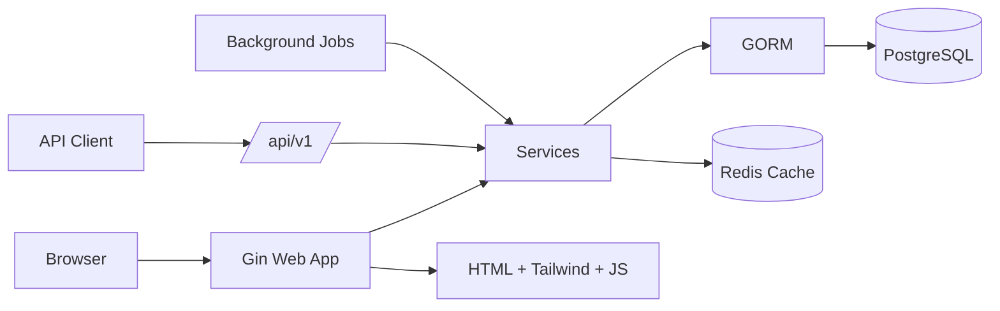

# Haridy ERP

Production-ready ERP starter for small businesses, built with Go, Gin, GORM, PostgreSQL, Redis, HTML, TailwindCSS, and JavaScript.

## Modules

- Authentication: sessions, bcrypt, login attempt limits, JWT API login.
- Multi-branch: branches, warehouses, current user branch, warehouse transfers.
- Inventory: items, categories, stock movements, warehouse balances, low-stock alerts.
- Sales: cash and credit invoices, barcode entry, printing, sales returns.
- Purchases: cash and credit purchase invoices, purchase returns.
- Treasury: receive, expense, sale, purchase, supplier payment transactions.
- Customers: balances, credit limits, statement, receipt vouchers.
- Suppliers: balances, statement, payment vouchers.
- Accounting: chart of accounts, automatic journal entries.
- RBAC: roles, permissions, role_permissions, user_roles, permission middleware.
- Reports: sales, purchases, stock movement, profits, general journal, Excel/PDF export.
- Notifications: stock, debt, and operational alerts on Dashboard.
- API v1: JSON endpoints protected by JWT.
- Background jobs: notifications, cleanup, backup marker.
- Security: secure headers, rate limiting, session expiration, audit logs.
- UI: responsive layout, collapsible sidebar, dark mode, charts, print views.

## Architecture



## Quick Start

Create the database:

```sql
CREATE DATABASE haridy_inventory;
```

Copy environment file:

```powershell
Copy-Item .env.example .env
```

Install dependencies and run:

```powershell
go mod tidy
go run ./cmd/server
```

Open:

```text
http://localhost:8080
```

Default user:

```text
username: admin
password: admin123
```

## Docker

```powershell
docker compose up -d --build
```

See [DEPLOYMENT.md](DEPLOYMENT.md).

## API v1

Login:

```http
POST /api/v1/auth/login
Content-Type: application/json

{"username":"admin","password":"admin123"}
```

Protected endpoints:

```text
GET /api/v1/items
GET /api/v1/sales
GET /api/v1/purchases
GET /api/v1/customers
GET /api/v1/suppliers
GET /api/v1/treasury
GET /api/v1/reports
```

Use:

```http
Authorization: Bearer <token>
```

## Project Structure

```text
cmd/server/          application entrypoint
configs/            environment and database config
internal/cache/      Redis client
internal/database/   migrations and seed orchestration
internal/handlers/   web and API handlers
internal/jobs/       scheduled background jobs
internal/middleware/ auth, RBAC, security, rate limiting, CSRF
internal/models/     GORM models
internal/services/   business logic and transactions
internal/routes/     web and API route registration
templates/           server-rendered pages
static/              CSS and JavaScript
migrations/          SQL migrations
deploy/nginx/        production reverse proxy config
```

## Production Notes

- Replace `APP_SECRET`, `JWT_SECRET`, and database passwords before deployment.
- Use HTTPS in front of Nginx.
- Replace the backup marker job with a real `pg_dump` or managed database backup.
- Run migrations through a controlled migration tool in production.
- Keep PostgreSQL and Redis private.
- Add observability: logs, metrics, database slow-query monitoring, and uptime checks.

Verification:

```powershell
go test ./...
```
