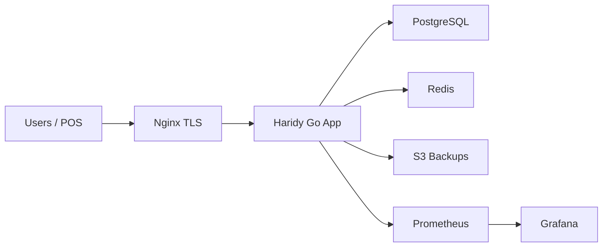

# Architecture

Haridy 2026 is a Go/Gin ERP with GORM persistence, PostgreSQL in production, Redis-backed cache paths, server-rendered views, and a small React frontend surface.

## Request Flow

1. Security, observability, rate limiting, and tenant resolution middleware run first.
2. Session and CSRF middleware protect browser flows.
3. Handlers call services for business transactions.
4. Services use database transactions for sales, purchases, returns, treasury, stock movements, and journal postings.
5. Integrity validators block unbalanced journals, duplicate postings, negative balances, and inventory corruption.

## Production Components

## Background Jobs

- Notification generation every 30 minutes.
- Login attempt cleanup every 6 hours.
- Accounting and inventory reconciliation every 3 hours.
- Backup marker and verification record every 24 hours. Production backup scripts live in `deploy/backup`.
